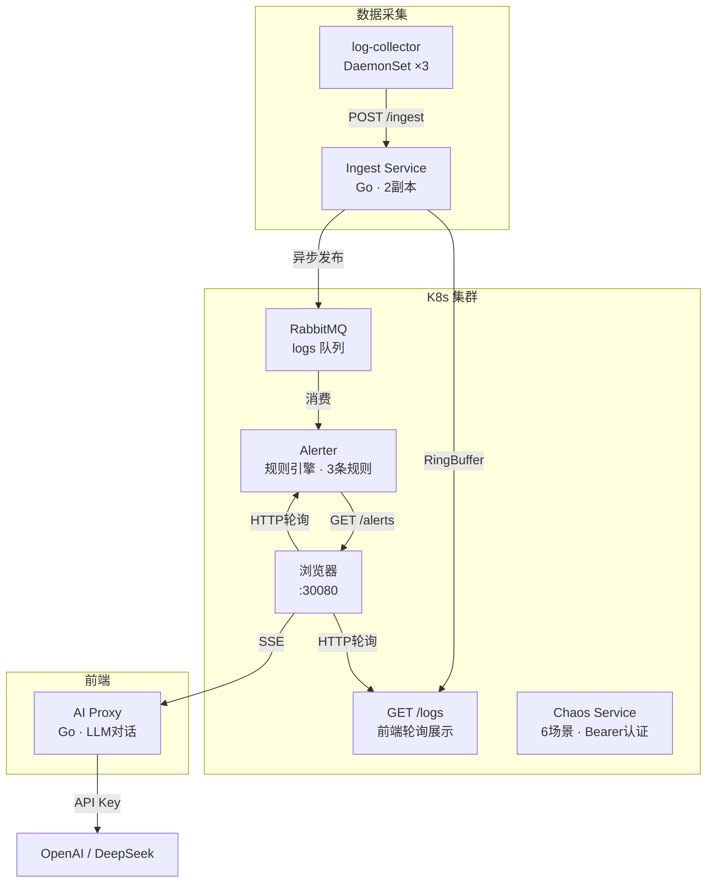

# 🦅 LogHawk — 实时日志智能分析平台

<p align="center">
  
</p>

<p align="center">
  <a href="https://github.com/linwumu/LogHawk/actions"></a>
  <a href="LICENSE"></a>
  <a href="#"></a>
  <a href="#"></a>
</p>

<p align="center">
  <b>多节点 K8s 集群上的实时日志分析系统，具备消息队列削峰、AI 异常检测、WebSocket 实时告警、故障自愈、完整可观测性。</b>
</p>

---

## 🎯 一句话

不是"我部署了一个网站"，而是"我设计了一套具备生产级高可用的微服务系统，能演示节点宕机后 0 数据丢失"。

---

## 🏗️ 架构



## 🧩 服务清单

| 服务 | 语言 | 职责 | 依赖 | 端口 | 状态 |
|------|------|------|------|------|------|
| **Ingest** | Go | 日志接收 → RingBuffer + RabbitMQ 发布 | amqp091-go | 8001 | ✅ |
| **Alerter** | Go | RabbitMQ 消费 → 规则引擎 → 告警推送 | amqp091-go, websocket | 8004 | ✅ |
| **AI Proxy** | Go | 🔍巡检 + 💬多轮诊断 + 📚RAG | 标准库 | 8003 | ✅ |
| **Frontend** | HTML/CSS/JS | 实时日志 + 告警中心 + 仪表盘 + 故障演练 | Chart.js 本地 | 80 | ✅ |
| **Chaos** | Go | 6 个故障场景注入引擎，Bearer Token 认证 | client-go | 8005 | ✅ |
| **Log Collector** | Go | DaemonSet 节点级日志采集 | 标准库 | — | ✅ |
| **PostgreSQL** | — | 日志归档（预留） | — | 5432 | 🔧 |
| **RabbitMQ** | — | 消息削峰，Ingest→Alerter 解耦 | — | 5672 | ✅ |
| **Redis** | — | Pub/Sub 缓存（预留） | — | 6379 | 🔧 |
| **Prometheus** | — | 自定义指标采集 | — | 9090 | ✅ |
| **Grafana** | — | 实时仪表盘 | — | 3000 | ✅ |

---

## 🧠 AI Agent 系统

| Agent | 功能 | 触发方式 |
|-------|------|---------|
| 🔍 **自主巡检** | 每 30s 扫描日志流，自动识别异常并推送 | 前端一键开关 |
| 💬 **多轮诊断** | 会话记忆，支持追问，携带日志上下文 | AI 面板直接对话 |
| 📚 **RAG 知识库** | 加载 `knowledge/*.md`，分析时引用最佳实践 | 启动时自动加载 |

**安全红线：AI 只建议命令，绝不自动执行。**

## 🔥 故障演练 (Chaos Engineering)

内置 SRE 技能训练沙盒，6 个渐进式故障场景：

| # | 场景 | 难度 | 注入操作 |
|---|------|------|---------|
| 1 | Pod 神秘消失 (CrashLoopBackOff) | 🥚 | 篡改 Deployment 镜像 tag |
| 2 | 流量进不来 (Service Endpoints 为空) | 🥚 | 修改 Service selector |
| 3 | 配置被改了 (无法连 RabbitMQ) | 🐣 | 修改 ConfigMap 值 |
| 4 | 谁把副本缩成 0 了 | 🐣 | Scale Deployment → 0 |
| 5 | 网络被墙了 (全断) | 🐔 | 创建 deny-all NetworkPolicy |
| 6 | 磁盘要炸了 (节点 NotReady) | 🐔 | 创建磁盘填充 Pod |

- 每关 3 级提示系统
- 5 分钟不修自动回滚
- 验证逻辑检查是否真正修复
- 所有操作限制在 loghawk namespace 内

```bash
# 触发故障（需 Bearer Token 鉴权）
curl -X POST http://chaos.loghawk:8005/chaos/break?scenario=pod-deleted \
  -H "Authorization: Bearer $CHAOS_API_TOKEN"
# 验证修复
curl -X POST http://chaos.loghawk:8005/chaos/verify?scenario=pod-deleted \
  -H "Authorization: Bearer $CHAOS_API_TOKEN"
```

> 🔒 **鉴权**：`/chaos/*` 接口强制 Bearer Token 认证，未配置时返回 503。
> 💻 **本地开发**：前端在 `localhost` 下自动跳过 Chaos 服务请求，避免 `ERR_NAME_NOT_RESOLVED`。所有命令以 `bash:copy` 格式输出，需人工审核后手动执行。

---

## 🎨 双主题

| 主题 | 触发 | 风格 |
|------|------|------|
| **专业版** | 默认 | Inter 字体、蓝白配色、精致阴影、专业运维面板 |
| **笨鹰版** | 点击 Logo 5 次 | ZCOOL KuaiLe 字体、马卡龙配色、粗黑描边、AI 变暴躁老哥 |

> 笨鹰模式下的 AI 会爆粗口、高抽象比喻、主动攻击人，但技术建议全部正确。

---


## ☸️ K8s 运维特性

| 特性 | 实现 | 说明 |
|------|------|------|
| **Pod Anti-Affinity** | requiredDuringScheduling | Ingest 2 副本强制分散在不同节点 |
| **TopologySpread** | maxSkew=1 | 副本均匀分布，跨节点容灾 |
| **PriorityClass** | loghawk-high (100万) | 内存压力时优先保护核心服务 |
| **HPA 自动扩缩** | CPU 70% 触发 | Ingest 2→6 副本弹性伸缩 |
| **PDB 中断预算** | minAvailable=1 | 自愿中断时至少保留 1 个副本 |
| **DaemonSet** | Log Collector | 每节点自动部署日志采集器 |
| **Graceful Shutdown** | SIGTERM → 10s 排空 | 滚动更新零中断 |
| **Liveness/Readiness** | HTTP Probe | 流量只打到就绪 Pod |
| **Helm Chart** | 12 个模板 | `helm install loghawk ./charts/loghawk` |
| **RBAC** | ServiceAccount + Role | Chaos 服务最小权限原则 |

## 🔒 生产级加固 (Hardening)

### 安全

| 项 | 实现 |
|---|------|
| **Secret 管理** | 所有密钥（镜像仓库、数据库、消息队列、OpenAI、Chaos API）均为占位符，**严禁提交明文**，通过 `kubectl create secret` 或外部 Secret Manager 注入 |
| **Chaos 鉴权** | `/chaos/*` 接口强制 Bearer Token 认证（`CHAOS_API_TOKEN`），未配置时返回 503，避免任意修改生产资源 |
| **敏感信息脱敏** | 启动日志不打印 API Key 明文，仅输出配置状态 |
| **NetworkPolicy** | 默认拒绝跨命名空间入站；Egress 仅放行 DNS(53)、同 namespace、HTTPS(443)，限制数据外泄面 |

### 可靠性

| 项 | 实现 |
|---|------|
| **日志采集 per-file offset** | log-collector 按文件持久化偏移量到 `/var/lib/loghawk/offsets.json`，重启不丢不重 |
| **采集失败重试** | ingest 发送失败最多重试 3 次，指数退避，避免瞬时网络抖动丢数据 |
| **优雅关闭** | SIGTERM → 停止采集 → 最后一次 flush → 保存 offset → 退出，DaemonSet 滚动更新零数据丢失 |
| **SSE 并发安全** | RingBuffer 采用订阅模式而非全局 size 切片，多客户端并发下数据一致 |
| **PatrolScheduler 竞态修复** | 用 `context.CancelFunc + sync.WaitGroup` 替代 close channel 重启模式，Start/Stop 并发安全 |
| **K8s API 超时** | Chaos 所有 client-go 调用带 15s 超时，防止 APIServer 慢导致 goroutine 泄漏 |
| **中间件权限对齐** | PostgreSQL / Redis / RabbitMQ 统一以 UID 999（官方镜像用户）运行，`fsGroup: 999` 保证 PVC 写入权限 |
| **镜像版本管理** | `deploy.sh` 支持 `IMAGE_TAG=v1.2.0` 固定版本部署；自动 `kubectl rollout status` 验证；支持 `kubectl rollout undo` 一键回滚 |

### 可运维性

| 项 | 实现 |
|---|------|
| **deploy.sh fail-fast** | 移除所有 `2>/dev/null`，每个 `kubectl apply` 失败立即退出，避免静默失败 |
| **就绪探针统一** | 所有服务 containerPort / probe / Service 端口三端对齐，Readiness 失败自动摘除流量 |
| **Prometheus metrics** | ingest / ai-proxy 暴露标准 `/metrics` 端点，与 Grafana 仪表盘打通 |

## 🚀 快速开始

### 方式 1：Docker Compose（本地开发）

```bash
git clone https://github.com/linwumu/LogHawk.git
cd LogHawk

# 启动所有服务
docker-compose up -d

# 打开前端
open http://localhost:30080

# AI 功能需要 API Key
export OPENAI_API_KEY=sk-xxx
docker-compose up -d ai-proxy

# 或用 Ollama（免费）
export OPENAI_BASE_URL=http://localhost:11434/v1
export OPENAI_API_KEY=ollama
export OPENAI_MODEL=qwen2.5:7b
docker-compose up -d ai-proxy
```

### 方式 2：K8s 部署

```bash
# 1. 起 3 节点 VM 集群
vagrant up
bash scripts/setup-cluster.sh

# 2. 初始化 Secret（生产环境建议用 Vault / External Secrets）
kubectl -n loghawk create secret generic loghawk-secret \
  --from-literal=POSTGRES_PASSWORD=$(openssl rand -hex 16) \
  --from-literal=RABBITMQ_PASS=$(openssl rand -hex 16) \
  --from-literal=OPENAI_API_KEY=sk-your-real-key \
  --from-literal=CHAOS_API_TOKEN=$(openssl rand -hex 32)

kubectl -n loghawk create secret docker-registry aliyun-registry \
  --docker-server=crpi-kwcxn84zbm6expkn.cn-guangzhou.personal.cr.aliyuncs.com \
  --docker-username=your-user \
  --docker-password=your-pass

# 3. 一键部署（默认 v1.0.0 标签）
bash scripts/deploy.sh

# 4. 发布指定版本（支持回滚）
IMAGE_TAG=v1.2.0 bash scripts/deploy.sh
kubectl -n loghawk rollout history deployment/ingest
kubectl -n loghawk rollout undo deployment/ingest --to-revision=1

# 5. 打开前端
open http://192.168.56.10:30080
```

### 方式 3：编译运行

```bash
make build        # 编译所有 Go 服务
./services/ingest/ingest     # 启动 Ingest (:8001)
./services/ai-proxy/ai-proxy # 启动 AI Proxy (:8003)
# 用任意 HTTP 服务器托管 services/frontend/
```

---

## 🔥 故障演示

| # | 场景 | 操作 | 观察 |
|---|------|------|------|
| 1 | 工作节点宕机 | `vagrant halt worker1` | 副本漂移，摄入速率 1 秒恢复，0 数据丢失 |
| 2 | 队列堆积自愈 | 停 Analyzer 1 分钟 → 恢复 | 队列深度图拉满 → 30 秒消化完毕 |
| 3 | WebSocket 断线重连 | `kubectl delete pod alerter-xxx` | 前端红框断开 → 3 秒自动重连 |
| 4 | 磁盘压力调度 | Worker 写满 `/tmp` | 污点出现 → 新 Pod 调度到健康节点 |
| 5 | 滚动更新零停机 | `kubectl set image deploy/ingest ingest:v2` | 逐个替换 → 摄入速率几乎无波动 |

```bash
bash scripts/fault-demo.sh 1    # 单场景
bash scripts/fault-demo.sh all  # 全部演示
```

---

## 📁 项目结构

```
LogHawk/
├── services/
│   ├── ingest/              # Go — 日志摄入 (零外部依赖)
│   │   ├── main.go
│   │   ├── go.mod
│   │   └── Dockerfile
│   ├── ai-proxy/            # Go — AI 分析代理 (零外部依赖)
│   │   ├── main.go
│   │   ├── go.mod
│   │   ├── Dockerfile
│   │   ├── deploy.yaml
│   │   └── knowledge/       # RAG 知识库
│   └── frontend/            # 纯 HTML/CSS/JS
│       ├── index.html
│       ├── nginx.conf
│       └── assets/          # Logo + 吉祥物图片
├── k8s/                     # Kubernetes 部署文件 (16个)
├── scripts/                 # deploy.sh + fault-demo.sh
├── docs/                    # 架构 + 部署 + 故障场景文档
├── monitoring/              # Grafana 仪表盘 JSON
├── docker-compose.yaml      # 本地一键启动
├── Makefile                 # 统一构建
├── Vagrantfile              # 3 节点 VM 配置
├── LICENSE                  # MIT
└── CONTRIBUTING.md
```

---

## 📊 可观测性

- **Prometheus 指标**：摄入速率、异常检出率、队列深度、WebSocket 连接数
- **Grafana 仪表盘**：预配置 JSON，导入即用
- **AI 巡检流**：SSE 实时推送分析结果到前端

---

## 🧠 面试能讲的故事

1. **多节点集群管理**："用 kubeadm 在 VirtualBox 上搭了 3 节点集群，测试过节点宕机、Pod 漂移、污点调度"
2. **消息队列削峰**："日志高峰时 RabbitMQ 缓冲，防止打爆下游，Prometheus 监控队列深度"
3. **WebSocket 实时推送**："Alerter 通过 Redis Pub/Sub 接收事件，WebSocket 推前端，断线 3 秒重连"
4. **AI Agent 设计**："Go 实现的三合一 AI 代理——自主巡检 + 多轮诊断 + RAG 知识库，API Key 服务端隔离"
5. **安全设计**："AI 只建议命令，绝不自动执行，需人工审核，命令格式 `bash:copy` 前端一键复制"
6. **零停机部署**："滚动更新期间 WebSocket 不断，摄入速率无显著波动"

---

> 💡 **LogHawk 不是玩具项目。它是一套完整的、可在面试现场演示故障自愈的微服务系统。**
